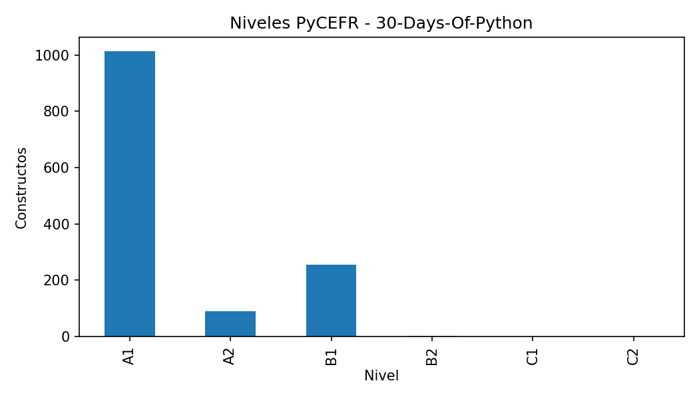
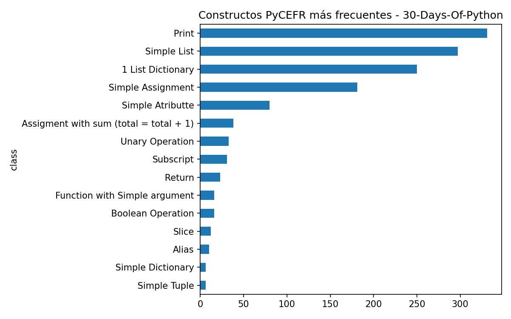
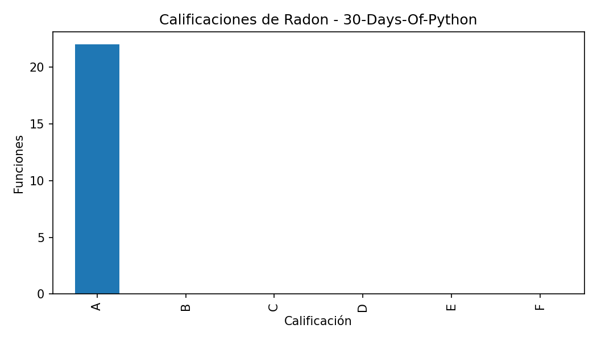
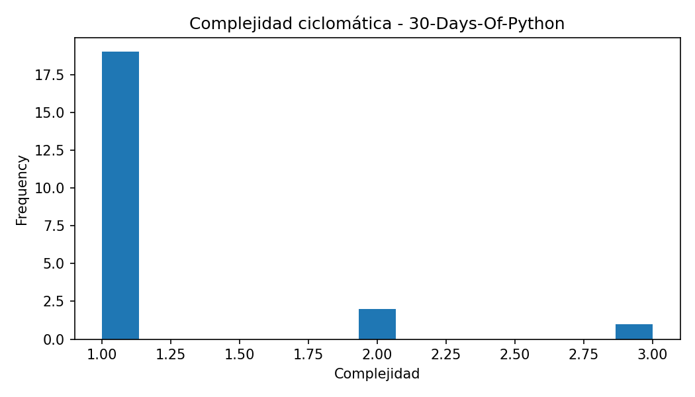
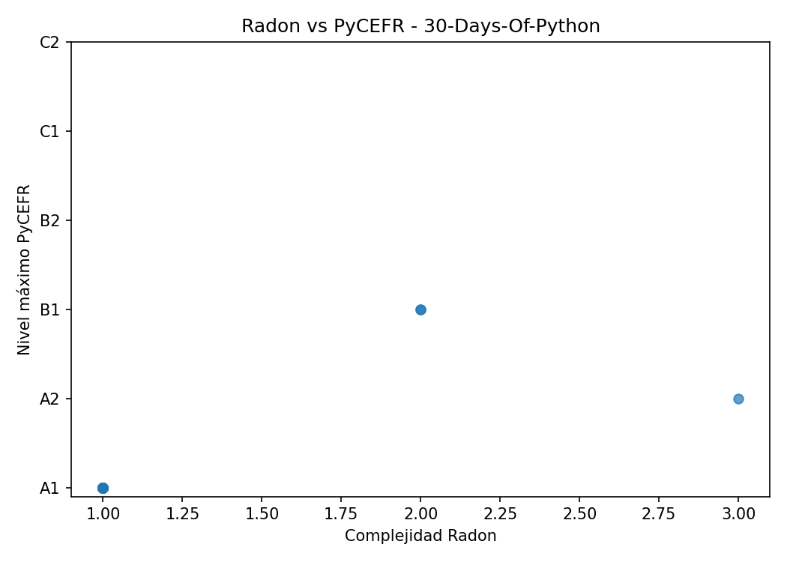

# Informe del caso: 30-Days-Of-Python

## Resumen general

- Constructos PyCEFR detectados: 1358

- Clases PyCEFR distintas: 29

- Nivel máximo PyCEFR: B2

- Funciones Radon detectadas: 22

- Complejidad máxima Radon: 3.0

- Calificación máxima de Radon: A

- Casos interesantes detectados: 0

## Interpretación inicial

En este caso no se han detectado grandes discrepancias automáticas con las reglas actuales. Aun así, puede ser útil revisar las funciones más complejas o los constructos de nivel más alto.

## Constructos PyCEFR más frecuentes

| class                                  |   count |
|:---------------------------------------|--------:|
| Print                                  |     331 |
| Simple List                            |     297 |
| 1 List Dictionary                      |     250 |
| Simple Assignment                      |     181 |
| Simple Atributte                       |      80 |
| Assigment with sum (total = total + 1) |      38 |
| Unary Operation                        |      33 |
| Subscript                              |      31 |
| Return                                 |      23 |
| Function with Simple argument          |      16 |

## Funciones más complejas según Radon

| file_name      | name               |   complexity | radon_grade   |   lineno |   endline |
|:---------------|:-------------------|-------------:|:--------------|---------:|----------:|
| app.py         | post               |            3 | A             |       29 |        35 |
| arithmetic.py  | add_numbers        |            2 | A             |        1 |         5 |
| arithmetics.py | add_numbers        |            2 | A             |        1 |         5 |
| mymodule.py    | generate_full_name |            1 | A             |        1 |         4 |
| mymodule.py    | sum_two_nums       |            1 | A             |        7 |         8 |
| mymodule.py    | generate_full_name |            1 | A             |        1 |         4 |
| arithmetic.py  | subtract           |            1 | A             |        8 |         9 |
| mymodule.py    | sum_two_nums       |            1 | A             |        6 |         7 |
| arithmetic.py  | remainder          |            1 | A             |       20 |        21 |
| arithmetic.py  | multiple           |            1 | A             |       12 |        13 |

## Casos interesantes

No se han detectado casos destacados con las reglas actuales.

## Figuras generadas

## Nota para revisión manual

Este informe se genera automáticamente. Las conclusiones finales deben revisarse manualmente para comprobar que los ejemplos seleccionados son representativos y adecuados para la memoria.