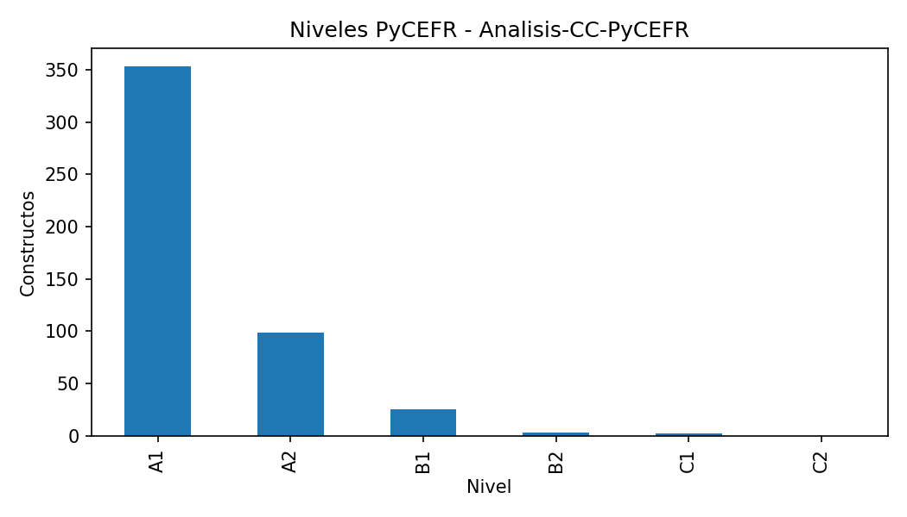
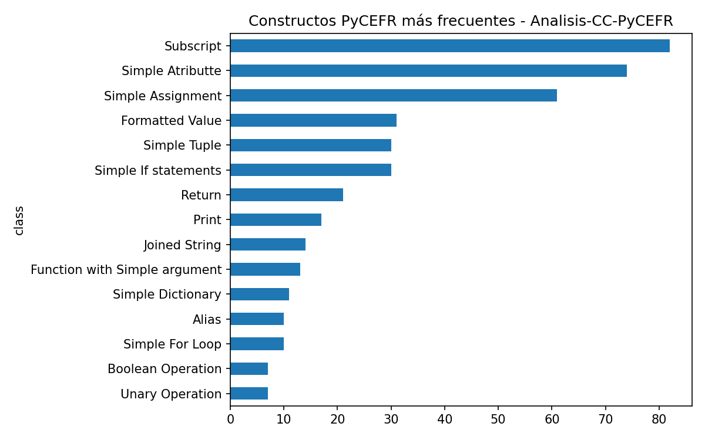
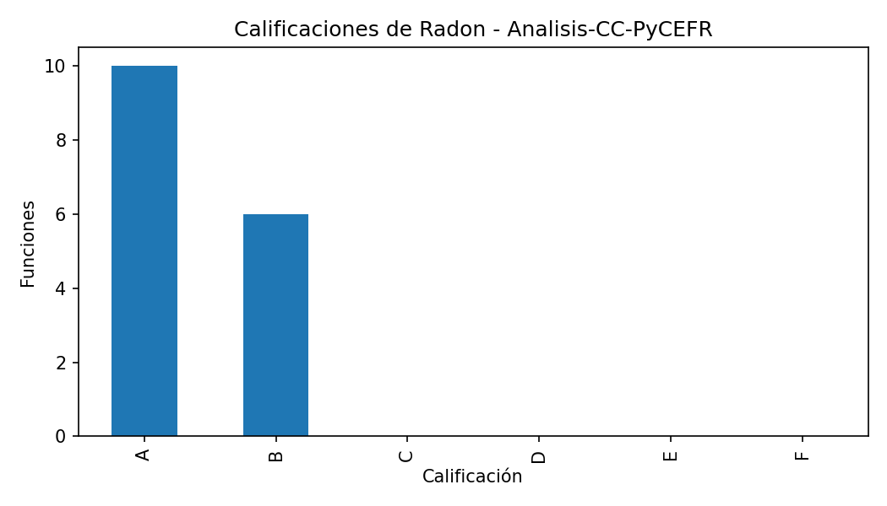
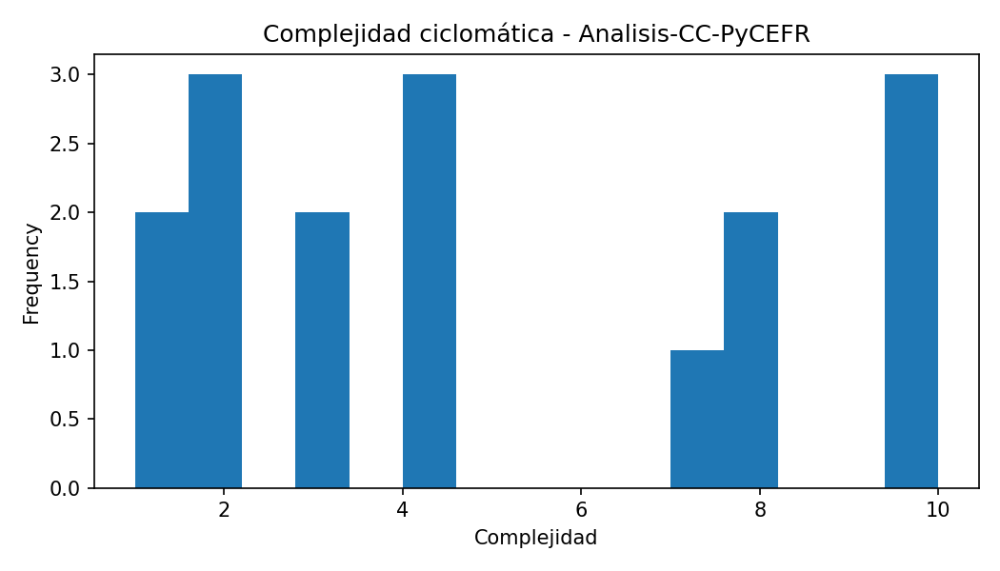
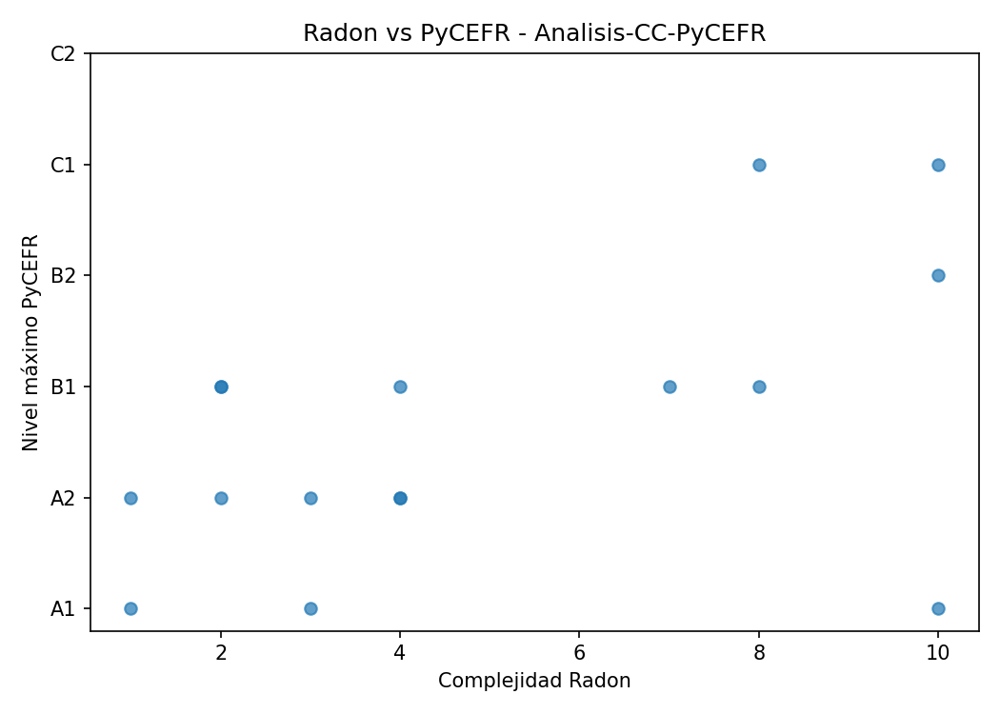

# Informe del caso: Analisis-CC-PyCEFR

## Resumen general

- Constructos PyCEFR detectados: 482

- Clases PyCEFR distintas: 39

- Nivel máximo PyCEFR: C1

- Funciones Radon detectadas: 16

- Complejidad máxima Radon: 10.0

- Calificación máxima de Radon: B

- Casos interesantes detectados: 4

## Interpretación inicial

Este caso contiene funciones donde las herramientas muestran patrones de coincidencia o discrepancia. Estos ejemplos son candidatos para comentarse en la memoria.

## Constructos PyCEFR más frecuentes

| class                         |   count |
|:------------------------------|--------:|
| Subscript                     |      82 |
| Simple Atributte              |      74 |
| Simple Assignment             |      61 |
| Formatted Value               |      31 |
| Simple If statements          |      30 |
| Simple Tuple                  |      30 |
| Return                        |      21 |
| Print                         |      17 |
| Joined String                 |      14 |
| Function with Simple argument |      13 |

## Funciones más complejas según Radon

| file_name    | name             |   complexity | radon_grade   |   lineno |   endline |
|:-------------|:-----------------|-------------:|:--------------|---------:|----------:|
| generator.py | walk             |           10 | B             |      228 |       245 |
| generator.py | extract_records  |           10 | B             |      206 |       248 |
| generator.py | print_report     |           10 | B             |      328 |       370 |
| generator.py | read_json        |            8 | B             |       66 |       157 |
| generator.py | normalize_record |            8 | B             |      182 |       202 |
| generator.py | compare          |            7 | B             |      269 |       324 |
| main.py      | get_folder_name  |            4 | A             |        7 |        21 |
| main.py      | choose_option    |            4 | A             |       32 |        46 |
| generator.py | as_number        |            4 | A             |      160 |       168 |
| generator.py | pick_first       |            3 | A             |      171 |       175 |

## Casos interesantes

| file_name    | function        |   complexity | radon_grade   | max_level   |   n_pycefr_constructs | case_type                                                       |
|:-------------|:----------------|-------------:|:--------------|:------------|----------------------:|:----------------------------------------------------------------|
| generator.py | extract_records |           10 | B             | C1          |                    50 | Coincidencia en dificultad alta                                 |
| generator.py | walk            |           10 | B             | B2          |                    18 | Coincidencia en dificultad alta                                 |
| generator.py | print_report    |           10 | B             | A1          |                   104 | Radon alto / PyCEFR bajo; Muchos constructos simples acumulados |
| generator.py | read_json       |            8 | B             | C1          |                    47 | Coincidencia en dificultad alta                                 |

## Figuras generadas

## Nota para revisión manual

Este informe se genera automáticamente. Las conclusiones finales deben revisarse manualmente para comprobar que los ejemplos seleccionados son representativos y adecuados para la memoria.