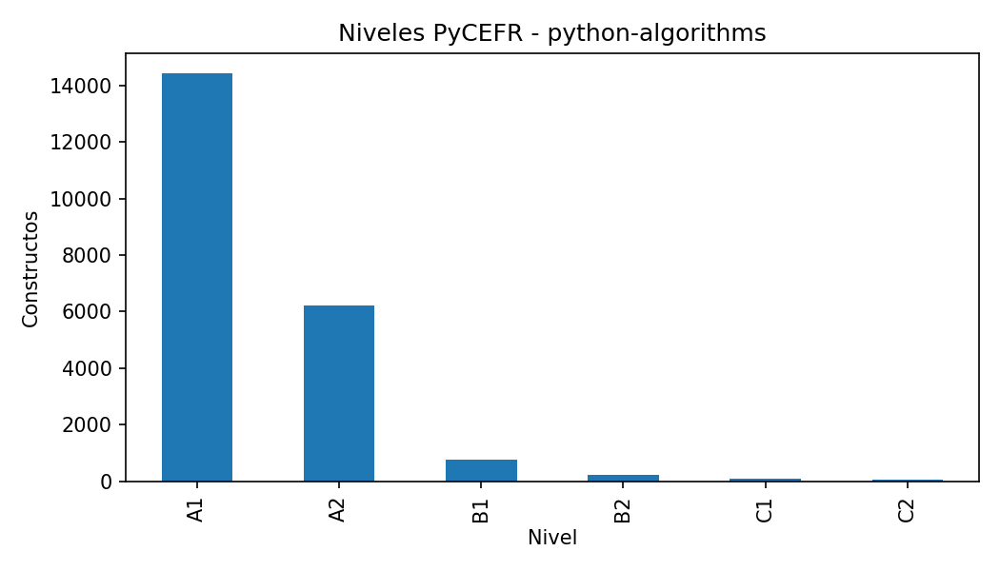
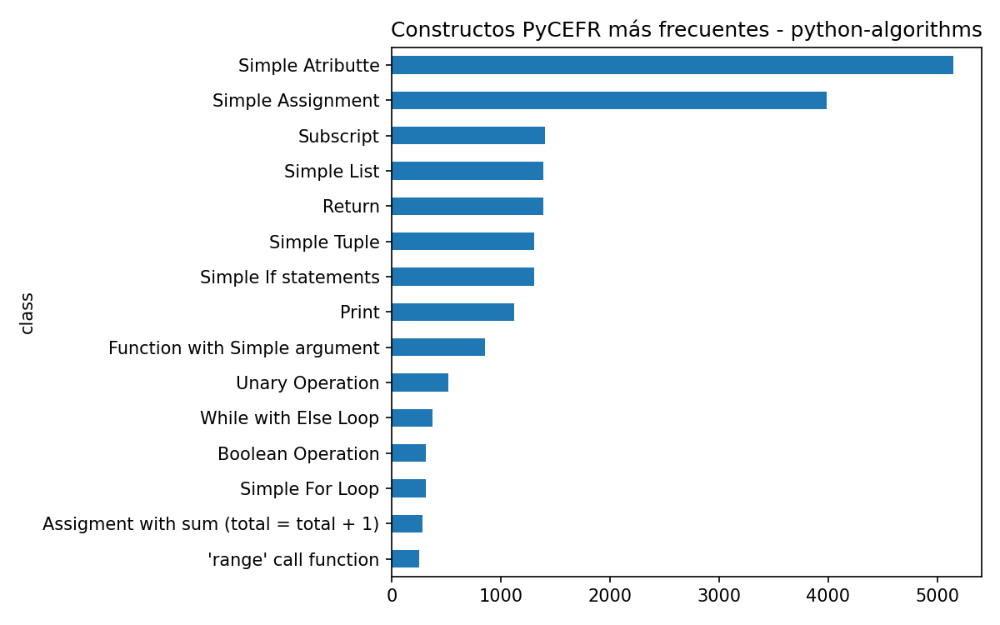
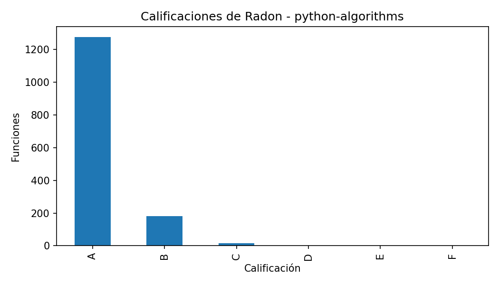
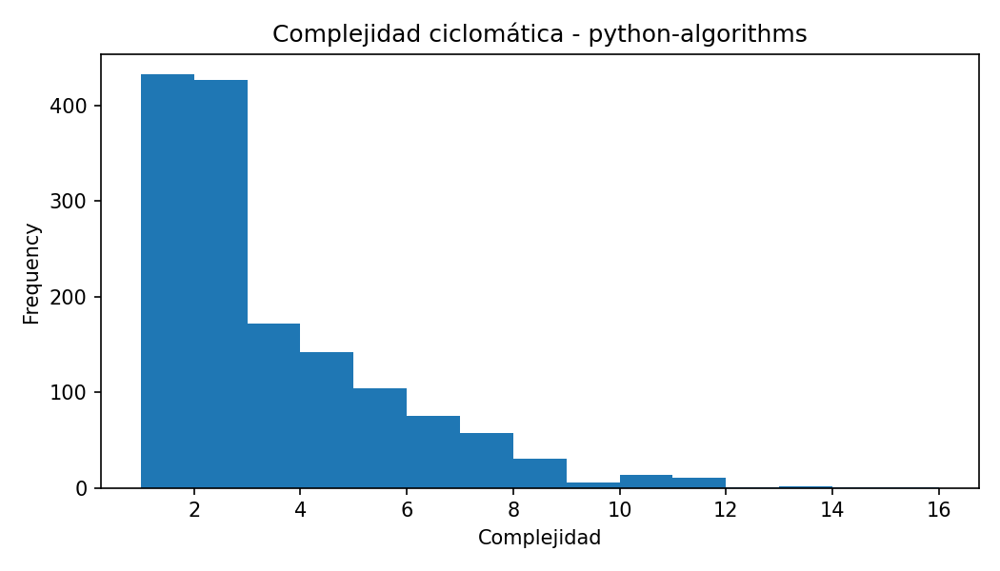
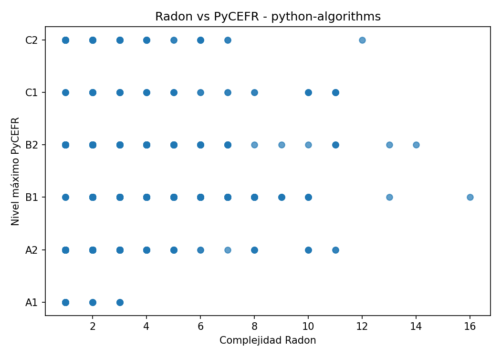

# Informe del caso: python-algorithms

## Resumen general

- Constructos PyCEFR detectados: 21724

- Clases PyCEFR distintas: 57

- Nivel máximo PyCEFR: C2

- Funciones Radon detectadas: 1474

- Complejidad máxima Radon: 16.0

- Calificación máxima de Radon: C

- Casos interesantes detectados: 232

## Interpretación inicial

Este caso contiene funciones donde las herramientas muestran patrones de coincidencia o discrepancia. Estos ejemplos son candidatos para comentarse en la memoria.

## Constructos PyCEFR más frecuentes

| class                         |   count |
|:------------------------------|--------:|
| Simple Atributte              |    5147 |
| Simple Assignment             |    3987 |
| Subscript                     |    1405 |
| Simple List                   |    1390 |
| Return                        |    1386 |
| Simple Tuple                  |    1308 |
| Simple If statements          |    1307 |
| Print                         |    1120 |
| Function with Simple argument |     856 |
| Unary Operation               |     521 |

## Funciones más complejas según Radon

| file_name                  | name             |   complexity | radon_grade   |   lineno |   endline |
|:---------------------------|:-----------------|-------------:|:--------------|---------:|----------:|
| is_bst_ordered.py          | is_bst_ordered   |           16 | C             |       25 |        51 |
| avl_tree.py                | deleteNode       |           14 | C             |      190 |       222 |
| alien_dictionary.py        | find_order       |           13 | C             |       18 |        59 |
| merge_two_binary_trees.py  | mergeTreesHelper |           13 | C             |        9 |        23 |
| median_in_sorted_arrays.py | merge_arrays     |           12 | C             |       13 |        48 |
| course_scheduling_order.py | find_order       |           11 | C             |       12 |        46 |
| detect_cycle_bfs.py        | is_cycle         |           11 | C             |        6 |        29 |
| binary_heap.py             | heapifyExtract   |           11 | C             |       70 |       101 |
| find_cycle.py              | topological_sort |           11 | C             |       13 |        47 |
| topological_sort.py        | topological_sort |           11 | C             |       13 |        48 |

## Casos interesantes

| file_name                                                | function            |   complexity | radon_grade   | max_level   |   n_pycefr_constructs | case_type                                                       |
|:---------------------------------------------------------|:--------------------|-------------:|:--------------|:------------|----------------------:|:----------------------------------------------------------------|
| bellman_ford_algorithm.py                                | bellmanFord         |            8 | B             | A2          |                    61 | Radon alto / PyCEFR bajo; Muchos constructos simples acumulados |
| dijkstras_algorithm_with_min_heap.py                     | dijkstra            |            5 | A             | C1          |                    46 | PyCEFR alto / Radon bajo                                        |
| dijkstras_algorithm_with_sorted_set.py                   | dijkstra            |            6 | B             | C1          |                    60 | Coincidencia en dificultad alta                                 |
| kosarajus_algorithm.py                                   | transpose_graph     |            4 | A             | C1          |                    28 | PyCEFR alto / Radon bajo                                        |
| topological_sort_bfs.py                                  | topological_sort    |           10 | B             | C1          |                    40 | Coincidencia en dificultad alta                                 |
| floyd_warshall_algorithm.py                              | floyd_warshall      |           11 | C             | A2          |                    44 | Radon alto / PyCEFR bajo; Muchos constructos simples acumulados |
| quick_sort.py                                            | quick_sort_helper   |            7 | B             | B2          |                    21 | Coincidencia en dificultad alta                                 |
| kadanes_algorithm.py                                     | kadanes_algorithm_2 |            5 | A             | A2          |                    26 | Muchos constructos simples acumulados                           |
| two_sum.py                                               | two_sum             |            3 | A             | C2          |                    39 | PyCEFR alto / Radon bajo                                        |
| reverse_linkedlist.py                                    | reverse_list        |            2 | A             | C1          |                    30 | PyCEFR alto / Radon bajo                                        |
| subtree_of_another_tree.py                               | same_tree           |            7 | B             | B2          |                    33 | Coincidencia en dificultad alta                                 |
| lca_bst.py                                               | lca_bst             |            6 | B             | B2          |                    29 | Coincidencia en dificultad alta                                 |
| construct_binary_tree_from_preorder_inorder_traversal.py | construct_tree      |            2 | A             | C2          |                    38 | PyCEFR alto / Radon bajo                                        |
| same_tree.py                                             | same_tree           |            7 | B             | B2          |                    24 | Coincidencia en dificultad alta                                 |
| max_product_brute_force.py                               | max_product         |            4 | A             | A2          |                    34 | Muchos constructos simples acumulados                           |

## Figuras generadas

## Nota para revisión manual

Este informe se genera automáticamente. Las conclusiones finales deben revisarse manualmente para comprobar que los ejemplos seleccionados son representativos y adecuados para la memoria.