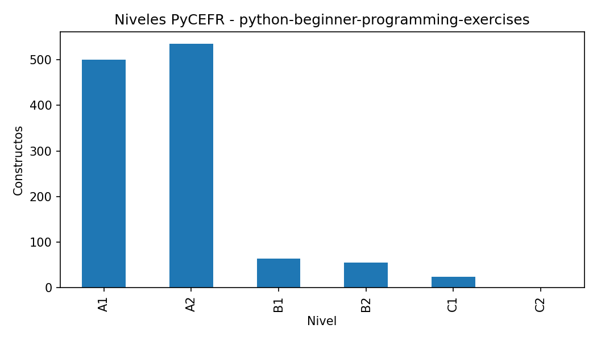
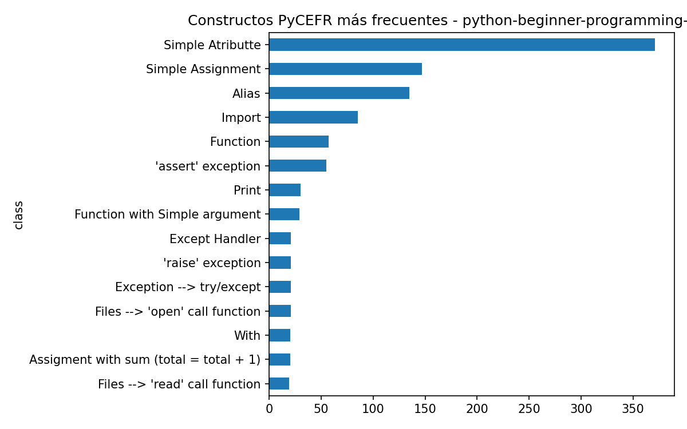
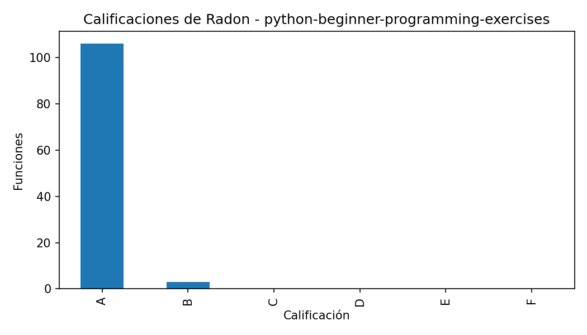
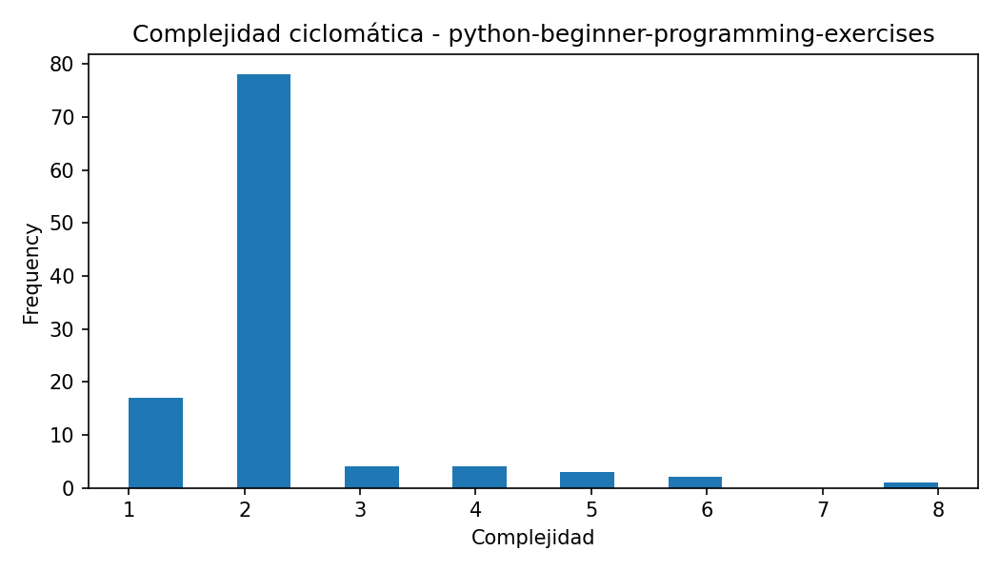
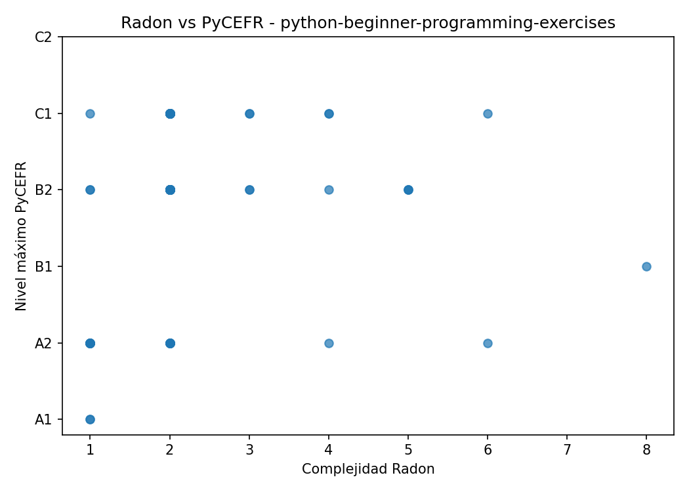

# Informe del caso: python-beginner-programming-exercises

## Resumen general

- Constructos PyCEFR detectados: 1176

- Clases PyCEFR distintas: 32

- Nivel máximo PyCEFR: C1

- Funciones Radon detectadas: 109

- Complejidad máxima Radon: 8.0

- Calificación máxima de Radon: B

- Casos interesantes detectados: 46

## Interpretación inicial

Este caso contiene funciones donde las herramientas muestran patrones de coincidencia o discrepancia. Estos ejemplos son candidatos para comentarse en la memoria.

## Constructos PyCEFR más frecuentes

| class                          |   count |
|:-------------------------------|--------:|
| Simple Atributte               |     371 |
| Simple Assignment              |     147 |
| Alias                          |     135 |
| Import                         |      85 |
| Function                       |      57 |
| 'assert' exception             |      55 |
| Print                          |      30 |
| Function with Simple argument  |      29 |
| Files --> 'open' call function |      21 |
| 'raise' exception              |      21 |

## Funciones más complejas según Radon

| file_name        | name                                 |   complexity | radon_grade   |   lineno |   endline |
|:-----------------|:-------------------------------------|-------------:|:--------------|---------:|----------:|
| test.py          | test_function_spin_chamber           |            8 | B             |       11 |        11 |
| test.py          | test_for_function_output             |            6 | B             |       29 |        29 |
| solution.hide.py | fizz_buzz                            |            6 | B             |        1 |        11 |
| test.py          | test_for_file_output                 |            5 | A             |       27 |        27 |
| test.py          | test_for_file_output                 |            5 | A             |       27 |        27 |
| test.py          | test_function_return_no_static       |            5 | A             |       40 |        50 |
| test.py          | test_function_output                 |            4 | A             |       20 |        21 |
| test.py          | test_function_returns_random_integer |            4 | A             |       29 |        36 |
| test.py          | test_for_return                      |            4 | A             |       21 |        26 |
| solution.hide.py | sing                                 |            4 | A             |        2 |        11 |

## Casos interesantes

| file_name        | function                             |   complexity | radon_grade   | max_level   |   n_pycefr_constructs | case_type                                                       |
|:-----------------|:-------------------------------------|-------------:|:--------------|:------------|----------------------:|:----------------------------------------------------------------|
| test.py          | test_for_return                      |            4 | A             | C1          |                   147 | PyCEFR alto / Radon bajo                                        |
| test.py          | test_for_type_random                 |            2 | A             | C1          |                    68 | PyCEFR alto / Radon bajo                                        |
| solution.hide.py | generate_random                      |            1 | A             | A2          |                    31 | Muchos constructos simples acumulados                           |
| test.py          | test_use_variable_name               |            2 | A             | C1          |                    25 | PyCEFR alto / Radon bajo                                        |
| test.py          | test_for_print                       |            2 | A             | C1          |                    85 | PyCEFR alto / Radon bajo                                        |
| test.py          | test_my_var1_exists                  |            2 | A             | C1          |                   152 | PyCEFR alto / Radon bajo                                        |
| test.py          | test_the_new_string_exists           |            2 | A             | C1          |                    88 | PyCEFR alto / Radon bajo                                        |
| test.py          | test_function_returns_random_integer |            4 | A             | C1          |                   132 | PyCEFR alto / Radon bajo                                        |
| test.py          | test_function_exists                 |            3 | A             | C1          |                   122 | PyCEFR alto / Radon bajo                                        |
| solution.hide.py | get_randomInt                        |            1 | A             | A2          |                    49 | Muchos constructos simples acumulados                           |
| solution.hide.py | spin_chamber                         |            1 | A             | A2          |                    27 | Muchos constructos simples acumulados                           |
| test.py          | test_for_loop                        |            2 | A             | C1          |                   100 | PyCEFR alto / Radon bajo                                        |
| solution.hide.py | standards_maker                      |            2 | A             | A2          |                    46 | Muchos constructos simples acumulados                           |
| test.py          | test_for_loop                        |            2 | A             | C1          |                   100 | PyCEFR alto / Radon bajo                                        |
| solution.hide.py | fizz_buzz                            |            6 | B             | A2          |                    97 | Radon alto / PyCEFR bajo; Muchos constructos simples acumulados |

## Figuras generadas

## Nota para revisión manual

Este informe se genera automáticamente. Las conclusiones finales deben revisarse manualmente para comprobar que los ejemplos seleccionados son representativos y adecuados para la memoria.