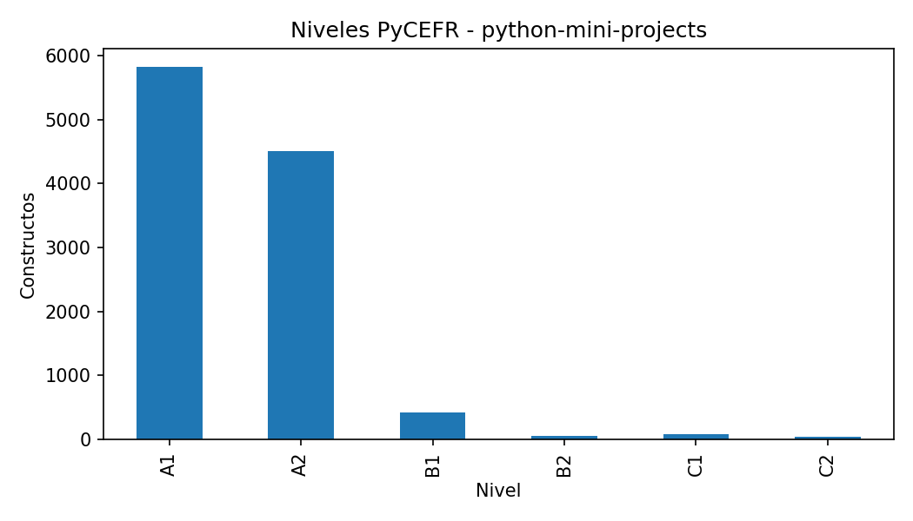
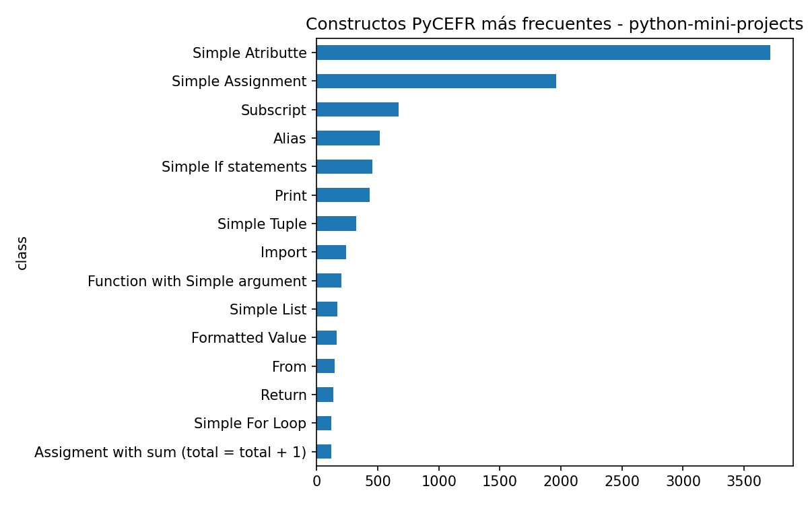
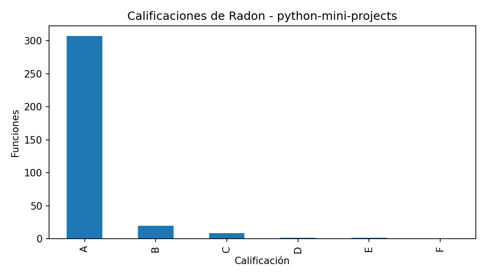
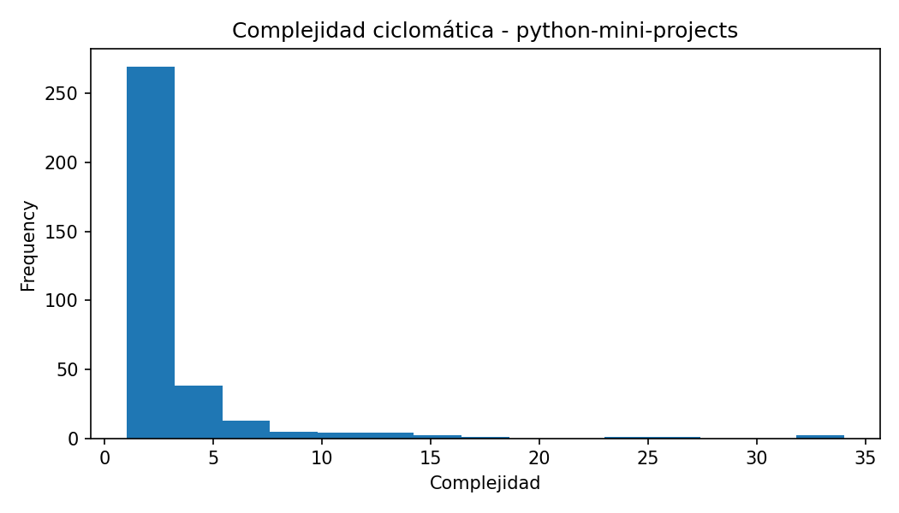
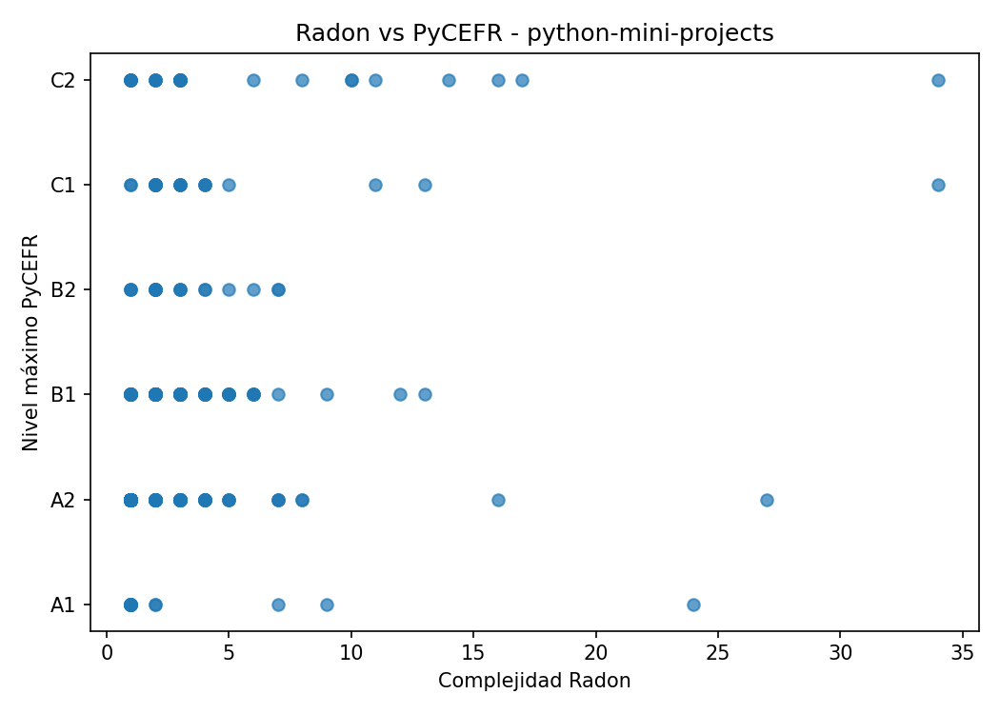

# Informe del caso: python-mini-projects

## Resumen general

- Constructos PyCEFR detectados: 10907

- Clases PyCEFR distintas: 83

- Nivel máximo PyCEFR: C2

- Funciones Radon detectadas: 340

- Complejidad máxima Radon: 34.0

- Calificación máxima de Radon: E

- Casos interesantes detectados: 83

## Interpretación inicial

Este caso contiene funciones donde las herramientas muestran patrones de coincidencia o discrepancia. Estos ejemplos son candidatos para comentarse en la memoria.

## Constructos PyCEFR más frecuentes

| class                         |   count |
|:------------------------------|--------:|
| Simple Atributte              |    3713 |
| Simple Assignment             |    1962 |
| Subscript                     |     672 |
| Alias                         |     518 |
| Simple If statements          |     454 |
| Print                         |     436 |
| Simple Tuple                  |     323 |
| Import                        |     242 |
| Function with Simple argument |     205 |
| Simple List                   |     167 |

## Funciones más complejas según Radon

| file_name                   | name          |   complexity | radon_grade   |   lineno |   endline |
|:----------------------------|:--------------|-------------:|:--------------|---------:|----------:|
| converter.py                | converter     |           34 | E             |       19 |        72 |
| bot.py                      | on_message    |           34 | E             |       41 |       171 |
| biling_system.py            | bill_area     |           27 | D             |      288 |       345 |
| tic-tac-toe-AI.py           | win_check     |           24 | D             |      154 |       168 |
| main.py                     | fetch         |           17 | C             |       15 |        82 |
| Rock-Paper-Scissors Game.py | spin          |           16 | C             |       23 |        58 |
| hangman.py                  | play          |           16 | C             |       16 |       101 |
| tic-tac-toe-AI.py           | CompAI        |           14 | C             |       95 |       124 |
| profilepic.py               | pp_download   |           13 | C             |        8 |        59 |
| utils.py                    | build_dataset |           13 | C             |       59 |        80 |

## Casos interesantes

| file_name                   | function           |   complexity | radon_grade   | max_level   |   n_pycefr_constructs | case_type                                                       |
|:----------------------------|:-------------------|-------------:|:--------------|:------------|----------------------:|:----------------------------------------------------------------|
| snake_game.py               | change_direction   |            9 | B             | A1          |                    13 | Radon alto / PyCEFR bajo                                        |
| snake_game.py               | next_turn          |            8 | B             | A2          |                    45 | Radon alto / PyCEFR bajo; Muchos constructos simples acumulados |
| snake_game.py               | check_collisions   |            8 | B             | A2          |                    21 | Radon alto / PyCEFR bajo                                        |
| ball_bounce.py              | move_ball          |            7 | B             | A2          |                    35 | Radon alto / PyCEFR bajo; Muchos constructos simples acumulados |
| converter.py                | converter          |           34 | E             | C2          |                   141 | Coincidencia en dificultad alta                                 |
| main.py                     | main               |            3 | A             | C2          |                   166 | PyCEFR alto / Radon bajo                                        |
| main.py                     | detect_align_faces |            2 | A             | C1          |                   269 | PyCEFR alto / Radon bajo                                        |
| Rock-Paper-Scissors Game.py | spin               |           16 | C             | A2          |                    37 | Radon alto / PyCEFR bajo; Muchos constructos simples acumulados |
| main.py                     | count              |            3 | A             | A2          |                    47 | Muchos constructos simples acumulados                           |
| main.py                     | StartPage          |            2 | A             | C1          |                   208 | PyCEFR alto / Radon bajo                                        |
| main.py                     | __init__           |            1 | A             | C1          |                   192 | PyCEFR alto / Radon bajo                                        |
| main.py                     | __init__           |            1 | A             | A2          |                    36 | Muchos constructos simples acumulados                           |
| main.py                     | SampleApp          |            3 | A             | C2          |                   139 | PyCEFR alto / Radon bajo                                        |
| main.py                     | count              |            3 | A             | A2          |                    44 | Muchos constructos simples acumulados                           |
| main.py                     | switch_frame       |            2 | A             | C2          |                    79 | PyCEFR alto / Radon bajo                                        |

## Figuras generadas

## Nota para revisión manual

Este informe se genera automáticamente. Las conclusiones finales deben revisarse manualmente para comprobar que los ejemplos seleccionados son representativos y adecuados para la memoria.